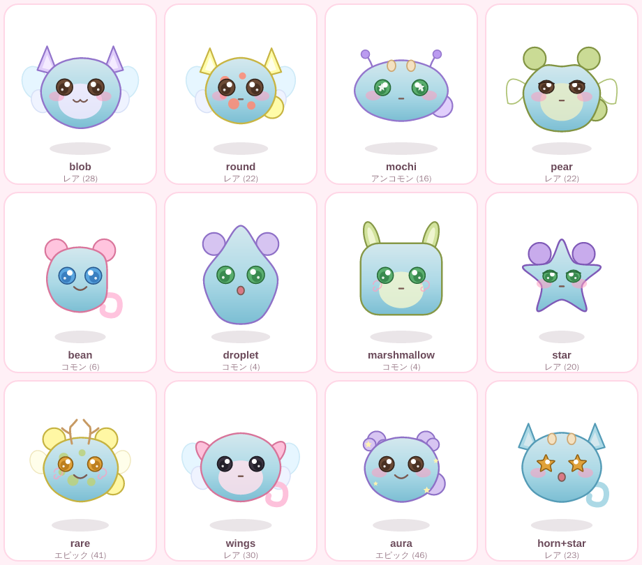

# 🧬 ゲノモン — ガチ育種選抜たまごっち

世界に一匹だけのモンスター「ゲノモン」を育てて・交配して・選抜する、本格遺伝シミュレーション × たまごっち。
**可愛さ**と**多種多様さ**を最優先に設計した、ブラウザだけで動く育成ゲームです。



## 特徴

### 🔬 ガチの遺伝システム
- 各ゲノモンは**二倍体ゲノム**（遺伝子ごとに2つの対立遺伝子）を持つ。
- **優性・劣性**：優性度の高い対立遺伝子が表現型として発現。レア形質の多くは**劣性**で隠れている。
- **ポリジーン形質**：大きさ・色の濃さ・瞳の大きさなどは複数遺伝子の加算で連続的に変化。
- **突然変異**：交配のたびに低確率で新しい対立遺伝子が出現。`へんいそくしんざい`で変異率アップ。
- **独立した組み合わせ**は実質無限。体型8種・配色20種・耳/目/口/しっぽ/つの/羽/オーラなど15以上の遺伝子座。

### 🌸 可愛さ最優先のビジュアル
- ゲノモンの見た目は**表現型からSVGで毎回生成**。どんな組み合わせでもパステル配色＋大きな瞳でキュートに。
- 待機モーション・まばたき・羽ばたき・オーラのきらめき。気分（ごきげん/おなかすいた/ねむい/さみしい）で表情が変化。

### 🥚 育種選抜のゲームループ
1. **たまごを温めて孵化**（ベビー → こども → おとな → ちょうろう に成長）。
2. お世話（ごはん・あそぶ・おそうじ・なでる・ねんね）で各ステータスを維持。
3. **おとな同士を交配**して 1〜3 個のたまごを産む。
4. `いでんしレンズ`で隠れた劣性遺伝子を見破り、**狙った形質を選抜交配**。
5. レアリティ（コモン〜**ミシック**）を上げ、**ずかん**を埋めてコンプリート！

> ランダム交配ではミシックはまず出ません。劣性レアを保因させて掛け合わせる「選抜」でしか到達できない設計です。

## あそびかた（開発）

```bash
npm install
npm run dev      # 開発サーバ起動（http://localhost:5173）
npm run build    # 本番ビルド（dist/）
npm run preview  # ビルド結果をプレビュー
```

セーブデータはブラウザの `localStorage` に自動保存され、再訪時も続きから遊べます（オフライン進行対応）。

## 技術スタック
- React 18 + TypeScript + Vite
- 状態管理・永続化：zustand（persist）
- 見た目：依存ゼロの手書きSVGジェネレータ

## ディレクトリ
```
src/
  genetics/   遺伝子定義・ゲノム・交配・レアリティ・配色
  render/     ゲノモンSVGレンダラー・体型パス生成
  game/       ゲーム状態ストア・お世話/成長/経済ロジック
  ui/         画面（おうち・ぼくじょう・たまご・こうはい・ずかん）
```

## ライセンス
MIT
